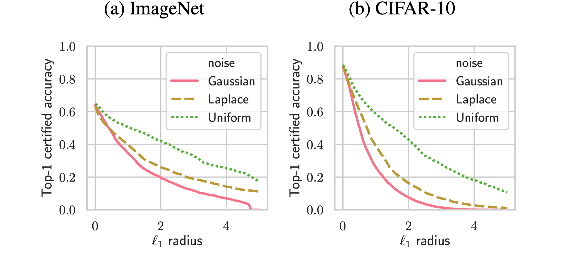
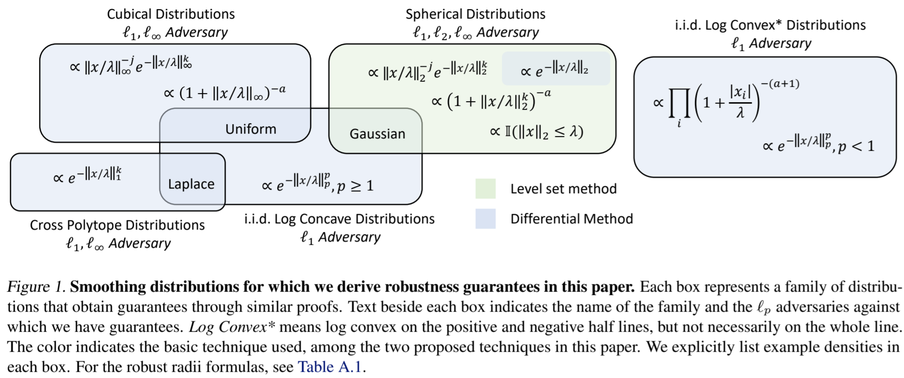
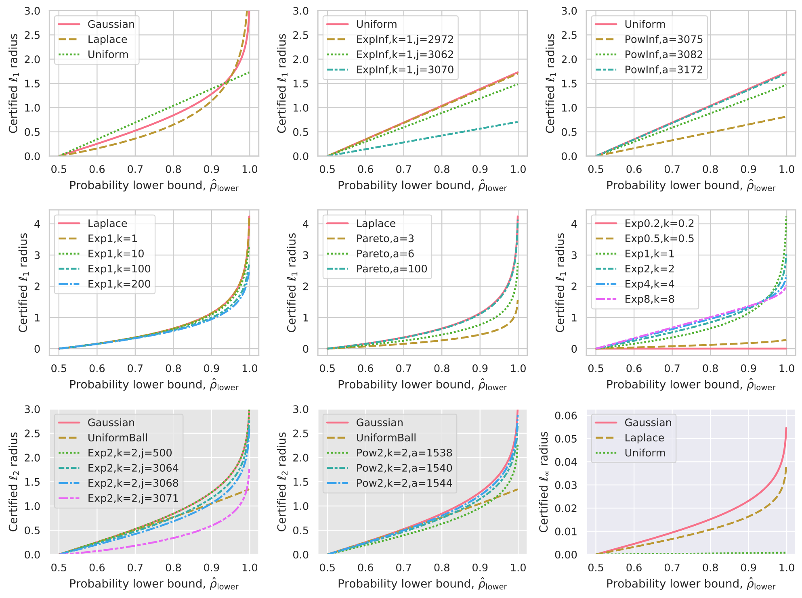

# Randomized Smoothing of All Shapes and Sizes

Last update: February 2020.

---

Code to accompany our paper:

**Randomized Smoothing of All Shapes and Sizes**  
*Greg Yang\*, Tony Duan\*, J. Edward Hu, Hadi Salman, Ilya Razenshteyn, Jerry Li.*  
[[Arxiv Link to Manuscript]](https://arxiv.org/abs/2002.08118)

Notably, we outperform existing provably $\ell_1$-robust classifiers on ImageNet and CIFAR-10.




This library implements the algorithms in our paper for computing robust radii for different smoothing distributions against different adversaries; for example, distributions of the form $e^{-\|x\|_\infty^k}$ against $\ell_1$ adversary.

The following summarizes the (distribution, adversary) pairs covered here.



We can compare the certified robust radius each of these distributions implies at a fixed level of $\hat\rho_\mathrm{lower}$, the lower bound on the probability that the classifier returns the top class under noise. Here all noises are instantiated for CIFAR-10 dimensionality ($d=3072$) and normalized to variance $\sigma^2 \triangleq \mathbb{E}[\|x\|_2^2]=1$. Note that the first two rows below certify for the $\ell_1$ adversary while the last row certifies for the $\ell_2$ adversary and the $\ell_\infty$ adversary. For more details see our `tutorial.ipynb` notebook.



## Getting Started

Clone our repository and install dependencies:

```shell
git clone https://github.com/tonyduan/rs4a.git
conda create --name rs4a python=3.6
conda activate rs4a
conda install numpy matplotlib pandas seaborn 
conda install pytorch torchvision cudatoolkit=10.0 -c pytorch
pip install torchnet tqdm statsmodels dfply
```

## Experiments

To reproduce our SOTA $\ell_1$ results on CIFAR-10, we need to train models over 
$$
\sigma \in \{0.15, 0.25, 0.5, 0.75, 1.0, 1.25, 1.5, 1.75,2.0,2.25, 2.5,2.75, 3.0,3.25,3.5\},
$$
For each value, run the following:

```shell
python3 -m src.train
--model=WideResNet
--noise=Uniform
--sigma={sigma}
--experiment-name=cifar_uniform_{sigma}

python3 -m src.test
--model=WideResNet
--noise=Uniform
--sigma={sigma}
--experiment-name=cifar_uniform_{sigma}
--sample-size-cert=100000
--sample-size-pred=64
--noise-batch-size=512
```

The training script will train the model via data augmentation for the specified noise and level of sigma, and save the model checkpoint to a directory `ckpts/experiment_name`.

The testing script will load the model checkpoint from the `ckpts/experiment_name` directory, make predictions over the entire test set using the smoothed classifier, and certify the $\ell_1, \ell_2,$ and $\ell_\infty$ robust radii of these predictions. Note that by default we make predictions with $64$ samples, certify with $100,000$ samples, and at a failure probability of $\alpha=0.001$.

To draw a comparison to the benchmark noises, re-run the above replacing `Uniform` with `Gaussian` and `Laplace`. Then to plot the figures and print the table of results (for $\ell_1$ adversary), run our analysis script:

```shell
python3 -m scripts.analyze --dir=ckpts --show --adv=1
```

Note that other noises will need to be instantiated with the appropriate arguments when the appropriate training/testing code is invoked. For example, if we want to sample noise $\propto \|x\|_\infty^{-100}e^{-\|x\|_\infty^{10}}$, we would run:

```shell
 python3 -m src.train
--noise=ExpInf
--k=10
--j=100
--sigma=0.5
--experiment-name=cifar_expinf_0.5
```

## Trained Models

Our pre-trained models are available. 

The following commands will download all models into the `pretrain/` directory. 

```shell
mkdir -p pretrain
wget --directory-prefix=pretrain http://www.tonyduan.com/resources/2020_rs4a_ckpts/cifar_all.zip
unzip -d pretrain pretrain/cifar_all.zip
wget --directory-prefix=pretrain http://www.tonyduan.com/resources/2020_rs4a_ckpts/imagenet_all.zip
unzip -d pretrain pretrain/imagenet_all.zip
```

ImageNet (ResNet-50): [[All Models, 2.3 GB]](http://www.tonyduan.com/resources/2020_rs4a_ckpts/imagenet_all.zip)

- Sigma=0.25: [[Uniform]](http://www.tonyduan.com/resources/2020_rs4a_ckpts/imagenet_uniform_025.pt) [[Gaussian]](http://www.tonyduan.com/resources/2020_rs4a_ckpts/imagenet_gaussian_025.pt) [[Laplace]](http://www.tonyduan.com/resources/2020_rs4a_ckpts/imagenet_laplace_025.pt)
- Sigma=0.5: [[Uniform]](http://www.tonyduan.com/resources/2020_rs4a_ckpts/imagenet_uniform_050.pt) [[Gaussian]](http://www.tonyduan.com/resources/2020_rs4a_ckpts/imagenet_gaussian_050.pt) [[Laplace]](http://www.tonyduan.com/resources/2020_rs4a_ckpts/imagenet_laplace_050.pt)
- Sigma=0.75: [[Uniform]](http://www.tonyduan.com/resources/2020_rs4a_ckpts/imagenet_uniform_075.pt) [[Gaussian]](http://www.tonyduan.com/resources/2020_rs4a_ckpts/imagenet_gaussian_075.pt) [[Laplace]](http://www.tonyduan.com/resources/2020_rs4a_ckpts/imagenet_laplace_075.pt)
- Sigma=1.0: [[Uniform]](http://www.tonyduan.com/resources/2020_rs4a_ckpts/imagenet_uniform_100.pt) [[Gaussian]](http://www.tonyduan.com/resources/2020_rs4a_ckpts/imagenet_gaussian_100.pt) [[Laplace]](http://www.tonyduan.com/resources/2020_rs4a_ckpts/imagenet_laplace_100.pt)
- Sigma=1.25: [[Uniform]](http://www.tonyduan.com/resources/2020_rs4a_ckpts/imagenet_uniform_125.pt) [[Gaussian]](http://www.tonyduan.com/resources/2020_rs4a_ckpts/imagenet_gaussian_125.pt) [[Laplace]](http://www.tonyduan.com/resources/2020_rs4a_ckpts/imagenet_laplace_125.pt)
- Sigma=1.5: [[Uniform]](http://www.tonyduan.com/resources/2020_rs4a_ckpts/imagenet_uniform_150.pt)
- Sigma=1.75: [[Uniform]](http://www.tonyduan.com/resources/2020_rs4a_ckpts/imagenet_uniform_175.pt)
- Sigma=2.0: [[Uniform]](http://www.tonyduan.com/resources/2020_rs4a_ckpts/imagenet_uniform_200.pt)
- Sigma=2.25: [[Uniform]](http://www.tonyduan.com/resources/2020_rs4a_ckpts/imagenet_uniform_225.pt)
- Sigma=2.5: [[Uniform]](http://www.tonyduan.com/resources/2020_rs4a_ckpts/imagenet_uniform_250.pt)
- Sigma=2.75: [[Uniform]](http://www.tonyduan.com/resources/2020_rs4a_ckpts/imagenet_uniform_275.pt)
- Sigma=3.0: [[Uniform]](http://www.tonyduan.com/resources/2020_rs4a_ckpts/imagenet_uniform_300.pt)
- Sigma=3.25: [[Uniform]](http://www.tonyduan.com/resources/2020_rs4a_ckpts/imagenet_uniform_325.pt)
- Sigma=3.5: [[Uniform]](http://www.tonyduan.com/resources/2020_rs4a_ckpts/imagenet_uniform_350.pt)

CIFAR-10 (Wide ResNet 40-2): [[All Models,  226 MB]](http://www.tonyduan.com/resources/2020_rs4a_ckpts/cifar_all.zip)

- Sigma=0.15: [[Uniform]](http://www.tonyduan.com/resources/2020_rs4a_ckpts/cifar_uniform_015.pt) [[Gaussian]](http://www.tonyduan.com/resources/2020_rs4a_ckpts/cifar_gaussian_015.pt) [[Laplace]](http://www.tonyduan.com/resources/2020_rs4a_ckpts/cifar_laplace_015.pt)
- Sigma=0.25: [[Uniform]](http://www.tonyduan.com/resources/2020_rs4a_ckpts/cifar_uniform_025.pt) [[Gaussian]](http://www.tonyduan.com/resources/2020_rs4a_ckpts/cifar_gaussian_025.pt) [[Laplace]](http://www.tonyduan.com/resources/2020_rs4a_ckpts/cifar_laplace_025.pt)
- Sigma=0.5: [[Uniform]](http://www.tonyduan.com/resources/2020_rs4a_ckpts/cifar_uniform_050.pt) [[Gaussian]](http://www.tonyduan.com/resources/2020_rs4a_ckpts/cifar_gaussian_050.pt) [[Laplace]](http://www.tonyduan.com/resources/2020_rs4a_ckpts/cifar_laplace_050.pt)
- Sigma=0.75: [[Uniform]](http://www.tonyduan.com/resources/2020_rs4a_ckpts/cifar_uniform_075.pt) [[Gaussian]](http://www.tonyduan.com/resources/2020_rs4a_ckpts/cifar_gaussian_075.pt) [[Laplace]](http://www.tonyduan.com/resources/2020_rs4a_ckpts/cifar_laplace_075.pt)
- Sigma=1.0: [[Uniform]](http://www.tonyduan.com/resources/2020_rs4a_ckpts/cifar_uniform_100.pt) [[Gaussian]](http://www.tonyduan.com/resources/2020_rs4a_ckpts/cifar_gaussian_100.pt) [[Laplace]](http://www.tonyduan.com/resources/2020_rs4a_ckpts/cifar_laplace_100.pt)
- Sigma=1.25: [[Uniform]](http://www.tonyduan.com/resources/2020_rs4a_ckpts/cifar_uniform_125.pt) [[Gaussian]](http://www.tonyduan.com/resources/2020_rs4a_ckpts/cifar_gaussian_125.pt) [[Laplace]](http://www.tonyduan.com/resources/2020_rs4a_ckpts/cifar_laplace_125.pt)
- Sigma=1.5: [[Uniform]](http://www.tonyduan.com/resources/2020_rs4a_ckpts/cifar_uniform_150.pt)
- Sigma=1.75: [[Uniform]](http://www.tonyduan.com/resources/2020_rs4a_ckpts/cifar_uniform_175.pt)
- Sigma=2.0: [[Uniform]](http://www.tonyduan.com/resources/2020_rs4a_ckpts/cifar_uniform_200.pt)
- Sigma=2.25: [[Uniform]](http://www.tonyduan.com/resources/2020_rs4a_ckpts/cifar_uniform_225.pt)
- Sigma=2.5: [[Uniform]](http://www.tonyduan.com/resources/2020_rs4a_ckpts/cifar_uniform_250.pt)
- Sigma=2.75: [[Uniform]](http://www.tonyduan.com/resources/2020_rs4a_ckpts/cifar_uniform_275.pt)
- Sigma=3.0: [[Uniform]](http://www.tonyduan.com/resources/2020_rs4a_ckpts/cifar_uniform_300.pt)
- Sigma=3.25: [[Uniform]](http://www.tonyduan.com/resources/2020_rs4a_ckpts/cifar_uniform_325.pt)
- Sigma=3.5: [[Uniform]](http://www.tonyduan.com/resources/2020_rs4a_ckpts/cifar_uniform_350.pt)

An example of usage is below. For more in depth example see our `tutorial.ipynb` notebook.

```python
from src.models import WideResNet
from src.noises import Uniform
from src.smooth import *

# load the model
model = WideResNet(dataset="cifar", device="cuda")
saved_dict = torch.load("pretrain/cifar_uniform_050.pt")
model.load_state_dict(saved_dict)
model.eval()

# instantiation of noise
noise = Uniform(device="cpu", dim=3072, sigma=0.5)

# training code, to generate samples
noisy_x = noise.sample(x)

# testing code, certify for L1 adversary
preds = smooth_predict_hard(model, x, noise, 64)
top_cats = preds.probs.argmax(dim=1)
prob_lb = certify_prob_lb(model, x, top_cats, 0.001, noise, 100000)
radius = noise.certify(prob_lb, adv=1)
```

## Repository

1. `ckpts/` is used to store experiment checkpoints and results.
2. `data/` is used to store image datasets.
4. `tables/` contains caches of pre-calculated tables of certified radii.
5. `src/` contains the main souce code.
6. `scripts/` contains the analysis and plotting code.

Within the `src/` directory, the most salient files are:

1. `train.py` is used to train models and save to `ckpts/`.
2. `test.py` is used to test and compute robust certificates for $\ell_1,\ell_2,\ell_\infty$ adversaries.
3. `noises/test_noises.py` is  a unit test for the noises we include. Run the test with
  
	```python -m unittest src/noises/test_noises.py```
	
    Note that some tests are probabilistic and can fail occasionally.
    If so, rerun a few more times to make sure the failure is not persistent.

4. `noises/noises.py` is a library of noises derived for randomized smoothing.